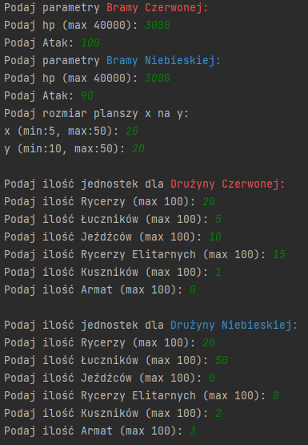
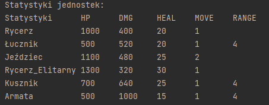
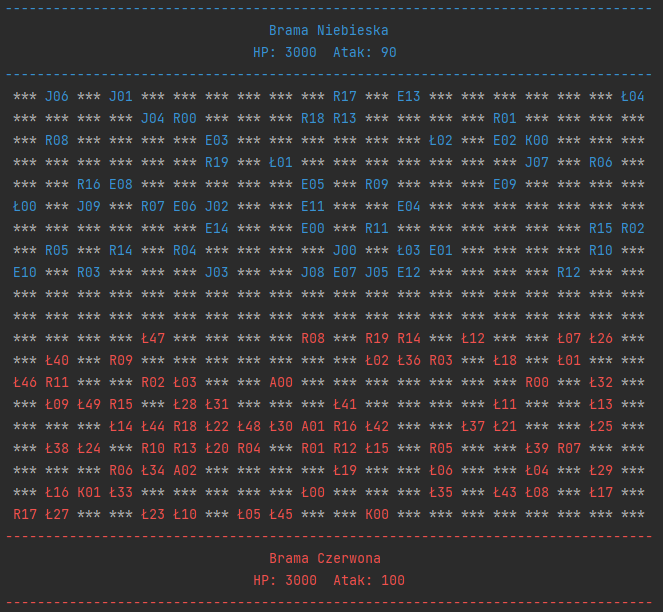
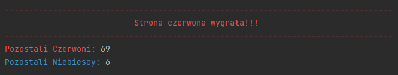

## Battlefield:

Symulacja ma zadanie przedstawić przebieg bitwy pomiędzy stroną czerwoną oraz niebieską. Bitwa i walki
odbywają się na planszy, jednostki mają zadanie dotrzeć na drugi koniec planszy, gdzie znajduje się brama
przeciwników i muszą ją zniszczyć. Zniszczenie danej bramy przesądza o wygranej strony. Podczas przejścia
przez planszę jednostki mogą natrafić na przeciwników. W takiej sytuacji dochodzi do walki, która kończy
się, dopóki któraś z jednostek nie zginie. W przypadku gdy na planszy nie pozostanie żadna żywa jednostka
symulacja kończy się remisem. Na początku programu zostaje wyświetlona informacja o statystykach
każdego typu jednostek. Potem program prosi użytkownika o podanie parametrów początkowych:

- Wytrzymałość i atak bramy czerwonej i niebieskiej (hp oraz atak)
- Rozmiar planszy, na której rozgrywa się bitwa (x i y)
- Ilość każdego typu jednostek każdej strony

## Typy jednostek:
- `Rycerz` – jednostka podstawowa, która porusza się o jedno pole. Jego atak aktywuje się, gdy pole przed nim
stoi przeciwnik.
- `Jeździec` – od rycerza różni się możliwością poruszania. Gdy w przypadku dwóch wolnych pól przed nim nie
ma żadnej jednostki, jeździec porusza się o dwa pola. Dotyczy to także sytuacji, gdy bezpośrednio przed
jeźdźcem znajduje się sojusznik, a dwa pola przed jeźdźcem jest wolne pole.  
- `Rycerz Elitarny` – posiada tarczę, która zmniejsza otrzymywane obrażenia.
- `Łucznik` – postać dystansowa. Może zadawać obrażenia przeciwnikom oddalonym do czterech pól  
- `Kusznik` – dziedziczy zasięg po łuczniku. Po oddaniu strzału Kusznik musi przeładować swoją broń, co sprawia, że nie może się poruszać ani atakować.
- `Armata` – dziedziczy po Kuszniku, jej atak zadaje obrażenia centralne oraz obrażenia wokół centrum równe połowie ataku centralnego. Armata też posiada
przeładowanie trwające 4 rundy 

## Wygenerowana plansza (przykładowa):

## Wynik symulacji:
Cały przebieg symulacjie jest zapisywany do pliku `WynikBitwy.txt`

## Autorzy Projektu:
- Szymon Bęczkowski
- Piotr Kontny